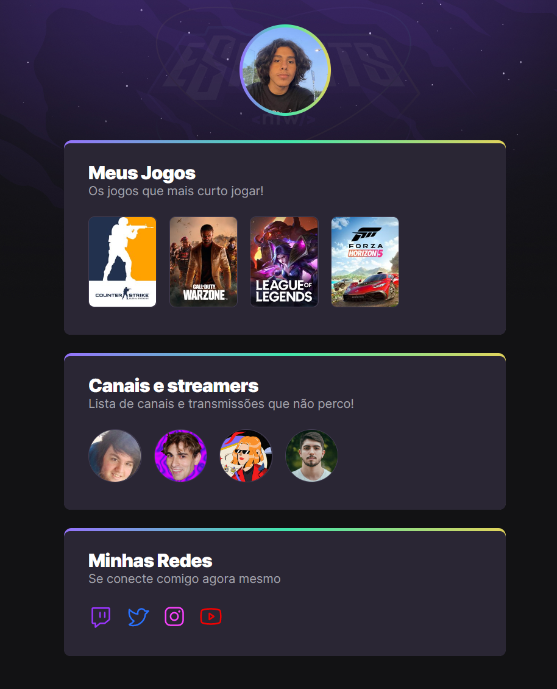

# 🕹️NLW eSports Trail

In this trail, we learn about HTML and CSS, and we made a website with our favorite games and streamrs, and put our social media.
It's important to say we've learned how to make animations in CSS, this is so COOL! I loved doing this trail, much love Rocketseat💜!

## This is the result 😯:

>Trail Explorer 🔎

[🔗Click here and access the website! ](https://brenolo04.github.io/NLW-eSports-explore/)

## ⚙️ Used technologies

- 📜HTML
- 🎨CSS

## My Social 📱

[My Instagram 🤳]( https://www.instagram.com/brenocaires_/)